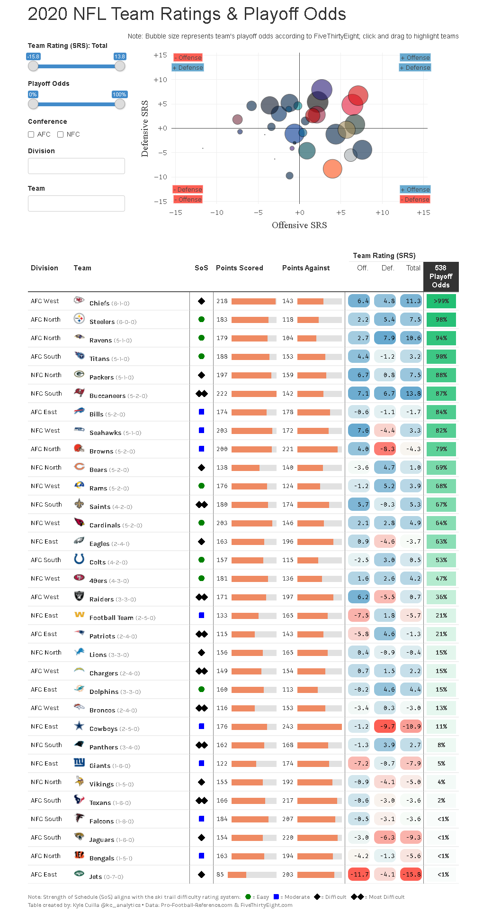
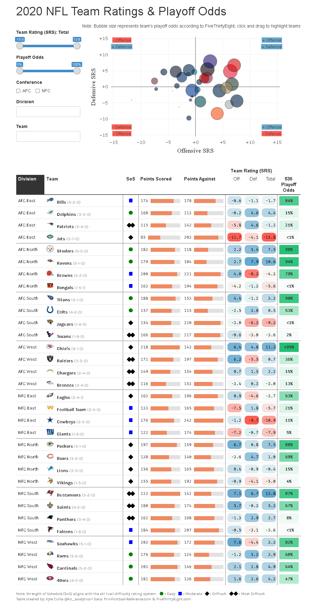

# 2020 NFL Team Ratings & Playoff Odds

Link:  https://rpubs.com/kcuilla/nfl_team_ratings_2020

Interactive data visualization displaying the NFL team ratings and playoff odds from the 2020 season. 

Data is sourced from Pro-Football-Reference.com and FiveThirtyEight.com, and pulls in the latest week available after each game in that week is played.

- Interactive plot built using the `plotly` package 
- Interactive table built using the `reactable` package
- Plot and table interact with each other through the `crosstalk` package

## Column Definitions

- SRS (Simple Rating System) is a rating based on point differential and strength of schedule. An SRS rating of 0.0 is average.
- SoS (Strength of Schedule) is the combined winning pct of the teams that each team played. For this table, I converted this into icons following the ski trail difficulty rating system to represent easy, moderate, difficult, and very difficult schedules
- 538 Playoff Odds are a team's odds of advancing to the playoffs based on 538's model

# Interactive Demo

# Full table

# Full table sorted by Division

