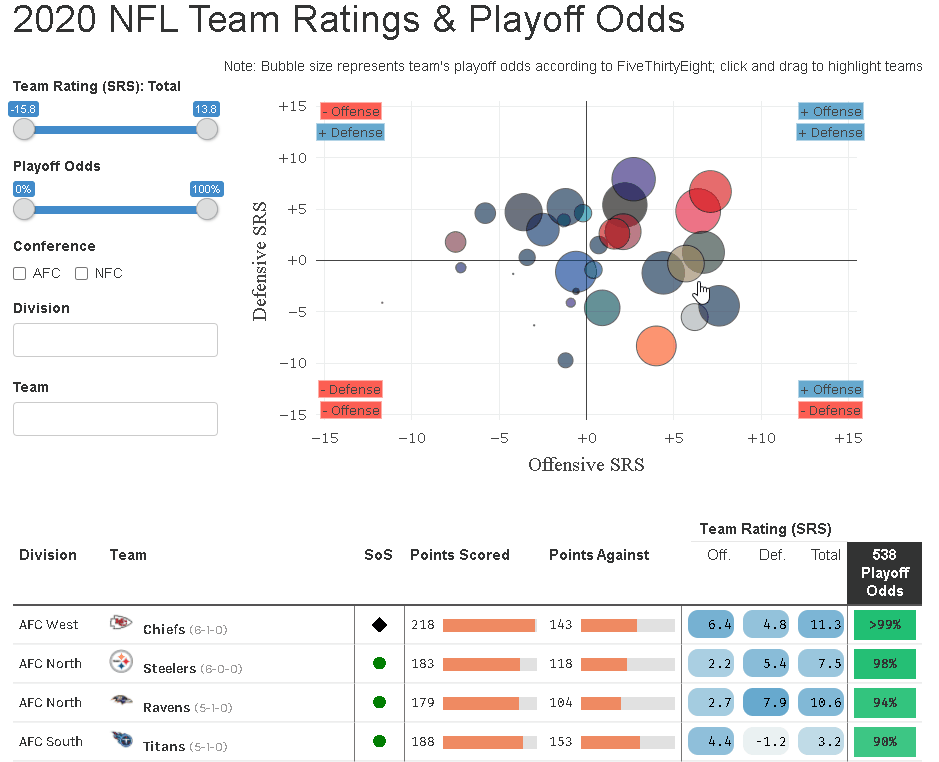
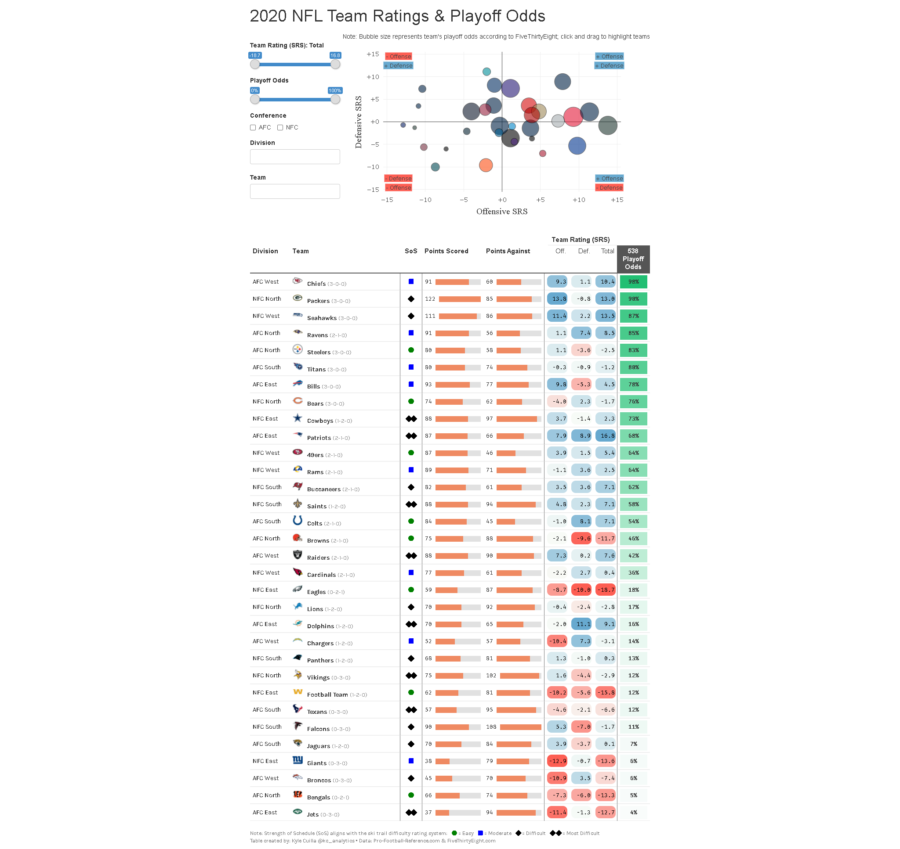
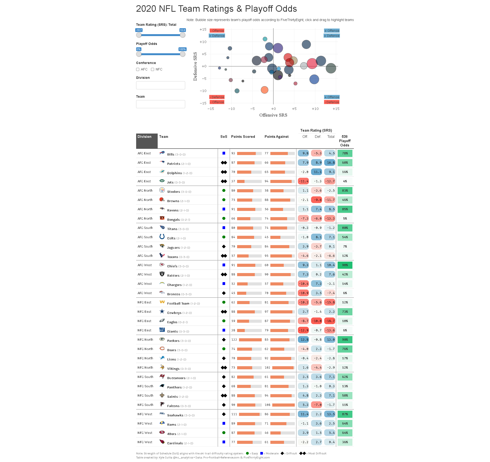

# 2020-RStudio-Table-Contest-Entry2

2020 NFL Team Ratings & Playoff Odds:  https://rpubs.com/kcuilla/nfl_team_ratings_2020

Interactive data visualization displaying the NFL team ratings and playoff odds from the 2020 season. 

Data is sourced from Pro-Football-Reference.com and FiveThirtyEight.com, and pulls in the latest week available after each game in that week is played.

- Interactive plot built using the `plotly` package 
- Interactive table built using the `reactable` package
- Plot and table interact with each other through the `crosstalk` package

Full table screenshot:

Sorted by Division:

